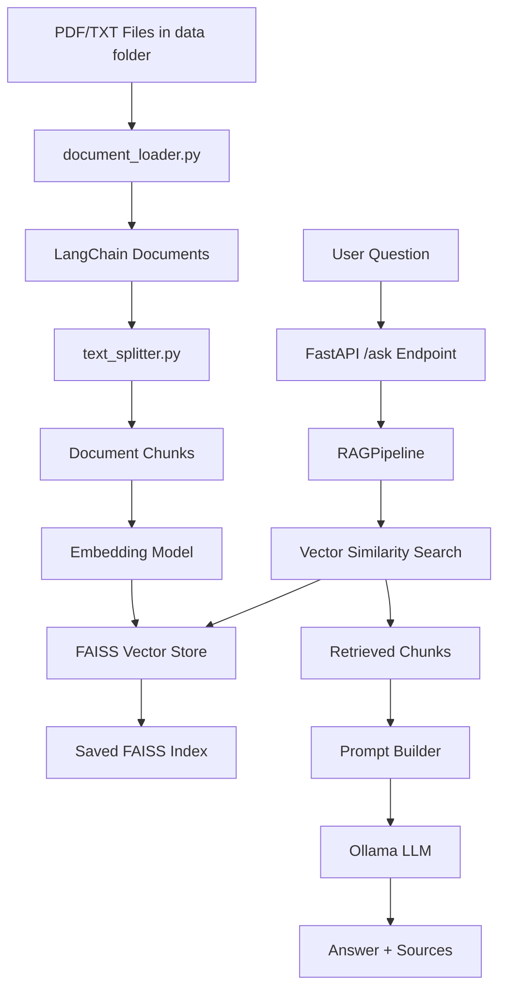
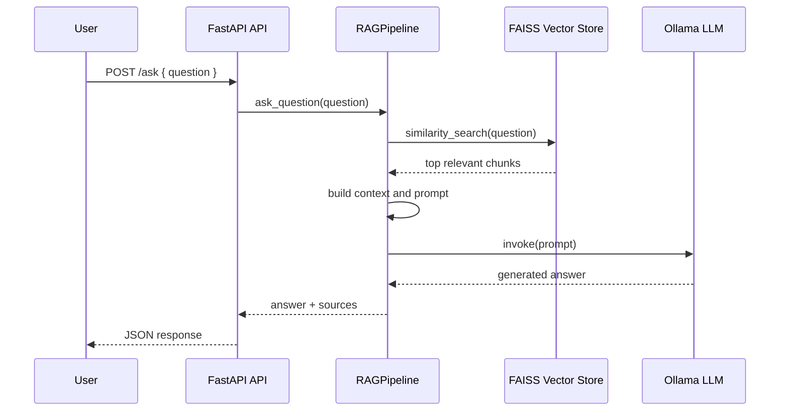
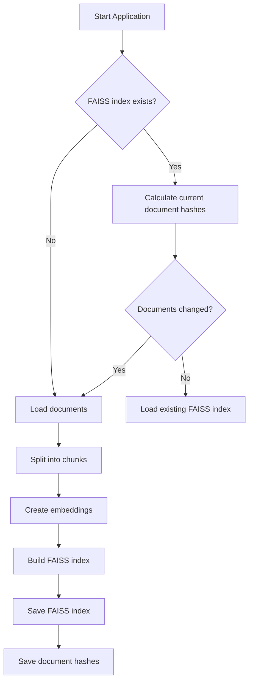

[](https://github.com/mahsarbpr/ai-rag-assistant/actions/workflows/tests.yml)

# AI RAG Assistant

A local Retrieval-Augmented Generation (RAG) application built with Python, LangChain, FAISS, Ollama, and FastAPI.

The system loads PDF/TXT documents, chunks them, creates embeddings, stores them in a FAISS vector database, and retrieves relevant context for LLM-based question answering.

---

# Features

- Local RAG pipeline
- PDF and TXT ingestion
- LangChain document processing
- Recursive text chunking
- Sentence-transformer embeddings
- FAISS vector similarity search
- Ollama local LLM integration
- Persistent FAISS index
- Automatic document change detection
- FastAPI backend
- Swagger API documentation
- Professional `src/` package structure
- Unit and integration testing
- GitHub Actions CI support
- Typed API request/response models

---

# Tech Stack

| Technology            | Purpose                      |
| --------------------- | ---------------------------- |
| Python                | Main language                |
| LangChain             | RAG orchestration utilities  |
| FAISS                 | Vector similarity search     |
| Ollama                | Local LLM serving            |
| FastAPI               | Backend API                  |
| Pydantic              | Request/response validation  |
| Sentence Transformers | Embedding generation         |
| PyPDF                 | PDF parsing                  |
| Pytest                | Unit and integration testing |

---

# Project Structure

```text
ai-rag-assistant/
│
├── .github/
│   └── workflows/
│       └── tests.yml
│
├── src/
│   └── rag_assistant/
│       ├── __init__.py
│       ├── config.py
│       ├── display.py
│       ├── document_loader.py
│       ├── index_metadata.py
│       ├── rag_pipeline.py
│       ├── rag_service.py
│       ├── text_splitter.py
│       └── vector_store.py
│
├── api/
│   ├── __init__.py
│   └── app.py
│
├── tests/
│   ├── fixtures/
│   │   └── sample.txt
│   │
│   ├── test_api.py
│   ├── test_document_loader.py
│   ├── test_index_metadata.py
│   ├── test_rag_pipeline.py
│   ├── test_rag_service.py
│   ├── test_text_splitter.py
│   └── test_vector_store.py
│
├── data/
├── faiss_index/
│
├── main.py
├── pyproject.toml
├── requirements.txt
└── README.md
```

---

# Package Architecture

The project uses a `src/`-based Python package layout to support:

- clean package imports
- scalable project organization
- editable package installation
- professional Python project structure
- improved test isolation

Example imports:

```python
from rag_assistant.rag_pipeline import RAGPipeline
```

---

# Low-Level Design

| Component            | Responsibility                                                  |
| -------------------- | --------------------------------------------------------------- |
| `main.py`            | CLI entry point for local testing                               |
| `api/app.py`         | FastAPI backend exposing `/ask` endpoint                        |
| `rag_pipeline.py`    | High-level orchestrator/facade for the RAG workflow             |
| `document_loader.py` | Loads `.pdf` and `.txt` files into LangChain `Document` objects |
| `text_splitter.py`   | Splits documents into smaller chunks                            |
| `vector_store.py`    | Creates, saves, loads, and searches FAISS vector store          |
| `rag_service.py`     | Builds context, prompt, retrieves docs, and generates answer    |
| `index_metadata.py`  | Detects document changes using file hashes                      |
| `display.py`         | CLI output formatting                                           |
| `config.py`          | Central configuration values                                    |

---

# Architecture Diagram



---

# Runtime Request Flow



---

# Indexing / Persistence Flow



---

# API Contract

## POST `/ask`

Request:

```json
{
  "question": "What are the documents about?"
}
```

Response:

```json
{
  "answer": "Generated answer based on retrieved context.",
  "sources": [
    {
      "file_name": "example.pdf",
      "page": 2,
      "source": "data/example.pdf"
    }
  ]
}
```

---

# Testing Strategy

The project uses multiple layers of testing.

| Test Type         | Purpose                                    |
| ----------------- | ------------------------------------------ |
| Unit Tests        | Validate isolated module behavior          |
| Integration Tests | Validate interactions between components   |
| API Tests         | Validate FastAPI request/response behavior |
| Pipeline Tests    | Validate end-to-end orchestration          |

Main test targets include:

- document loading
- text chunking
- vector store persistence
- metadata fingerprinting
- API validation
- RAG pipeline orchestration

---

# Setup

## 1. Create virtual environment

```bash
python -m venv .venv
```

---

## 2. Activate environment

### Windows

```bash
.venv\Scripts\activate
```

### Linux/Mac

```bash
source .venv/bin/activate
```

---

## 3. Install dependencies

```bash
pip install -r requirements.txt
```

---

## 4. Install package in editable mode

```bash
pip install -e .
```

This installs the project as a local Python package and enables package-based imports.

---

# Ollama Setup

Install Ollama:

https://ollama.com/

Pull local model:

```bash
ollama pull phi3
```

---

# Running the FastAPI Server

```bash
uvicorn api.app:app --reload
```

Open Swagger documentation:

```text
http://127.0.0.1:8000/docs
```

---

# Running Local CLI Version

```bash
python main.py
```

---

# Running Tests

Run all tests:

```bash
pytest
```

Run tests with coverage:

```bash
pytest --cov=rag_assistant
```

Generate HTML coverage report:

```bash
pytest --cov=rag_assistant --cov-report=html
```

Open:

```text
htmlcov/index.html
```

---

# Development Workflow

Typical development workflow:

```bash
# activate environment
.venv\Scripts\activate

# install editable package
pip install -e .

# run tests
pytest

# run coverage
pytest --cov=rag_assistant

# start FastAPI server
uvicorn api.app:app --reload
```

---

# Architecture Principles

The project follows several software engineering principles:

- Separation of concerns
- Modular package architecture
- Persistent vector storage
- Typed API contracts
- Test-driven validation of core components
- Reusable orchestration pipeline
- Clear API/service boundaries

---

# Current Status

Implemented:

- Local RAG pipeline
- PDF/TXT ingestion
- FAISS persistence
- Automatic index rebuild detection
- FastAPI backend
- Swagger documentation
- Installable package architecture
- Unit and integration tests

Planned:

- Streamlit frontend
- File upload support
- Incremental indexing
- Async inference
- Conversation memory

```

```
